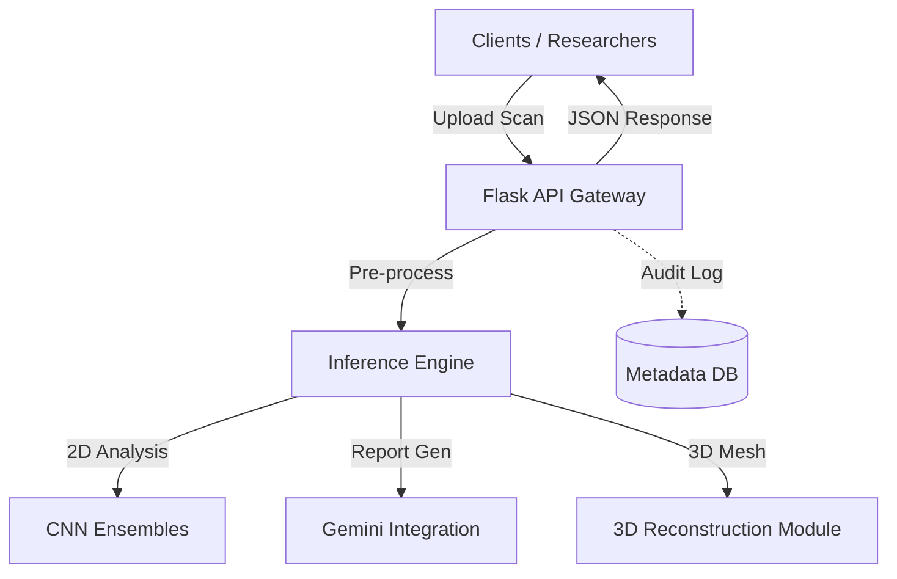

# 🩺 HemaVision AI

> **Next-Generation Medical Imaging Analysis & Triage System**

[](https://opensource.org/licenses/MIT)
[](https://www.python.org/)
[](https://flask.palletsprojects.com/)
[](https://www.docker.com/)
[](https://github.com/psf/black)

---

## 🚨 Medical Disclaimer

> **CRITICAL WARNING**: HemaVision AI is a **Research Prototype**.
>
> - **NOT** FDA approved.
> - **NOT** intended for clinical diagnosis, treatment, or patient management.
> - No medical decisions should be made based on this software.
> - Always verify results with a certified radiologist.

---

## � Overview

**HemaVision AI** is a state-of-the-art framework designed to assist medical researchers in analyzing complex imaging data. moving beyond simple classification, HemaVision integrates **Generative AI** for semantic reporting and **3D Reconstruction** for structural visualization.

### 🌟 Key Features

- **🤖 AI-Powered Triage**: Automated risk assessment using ensembles of CheXNet and DenseNet models.
- **📝 Semantic Reporting**: LLM-integrated generation of patient-centric explanations (via Gemini API).
- **🧊 3D Bone Reconstruction**: Experimental point-cloud generation from 2D input slices.
- **🛡️ Privacy-First Architecture**: "Zero-Retention" design ensures no patient data persists after analysis.
- **🔥 Heatmap Visualization**: Grad-CAM integrations to highlight regions of interest.

---

## 🏗️ System Architecture

The repository uses a clear, decoupled structure to ensure scalability and safety.



### � Directory Map

| Directory       | Purpose                                          |
| :-------------- | :----------------------------------------------- |
| `src/app`       | Core API server & request routing (Flask)        |
| `src/inference` | Neural network prediction pipelines              |
| `src/models`    | Model definitions (Weights are strictly ignored) |
| `src/utils`     | DICOM parsing, image normalization, & helpers    |
| `frontend/`     | Standalone prototypes (3D Viewer)                |
| `scripts/`      | Training routines & audit tools                  |
| `docs/`         | Compliance policy & architectural decisions      |

---

## 🚀 Getting Started

### Prerequisites

- **Docker Desktop** (Recommended)
- **Python 3.9+** (For local dev)
- **Git**

### ⚡ Quick Start (Docker)

The easiest way to run HemaVision AI is via Docker Compose.

1.  **Clone the Repository**

    ```bash
    git clone https://github.com/cod-x-prince/med_image.git
    cd med_image
    ```

2.  **Launch Services**
    ```bash
    docker-compose up --build
    ```
    - API: `http://localhost:5000`
    - Docs: `http://localhost:5000/docs`

### 🔧 Local Installation

1.  **Initialize Environment**

    ```bash
    python -m venv venv
    source venv/bin/activate  # Windows: .\venv\Scripts\Activate
    ```

2.  **Install Dependencies**

    ```bash
    pip install -r requirements.txt
    ```

3.  **Model Setup**

    > **Note**: This repo does **NOT** contain model weights (>100MB).
    > Place your `.pth` or `.onnx` checkpoints in `src/models/` manually.

4.  **Run Application**
    ```bash
    python run.py
    ```

---

## 🛡️ Security & Compliance

We adhere to strict **DevSecOps** principles for medical software:

1.  **No Secrets In Code**: All credentials are managed via environment variables.
2.  **Data Isolation**: Medical images are processed in-memory and immediately discarded.
3.  **Audit Trails**: Non-PII logging tracks system performance and error rates.

See [Data Governance Policy](docs/data-policy.md) for details.

---

## 🗺️ Roadmap

- [x] **Phase 1**: Core Architecture & Security Audit
- [ ] **Phase 2**: React/Next.js Client Migration
- [ ] **Phase 3**: OHIF Viewer Integration
- [ ] **Phase 4**: DICOMweb Standard Support

---

## 🤝 Contributing

Contributions are welcome! Please read `docs/architecture.md` before submitting a PR.
**Rule #1**: NEVER commit medical data (DICOM/NIfTI) or Secrets.

## � License

Distributed under the MIT License. See `LICENSE` for more information.

---

_Built with ❤️ by the HemaVision AI Team_
